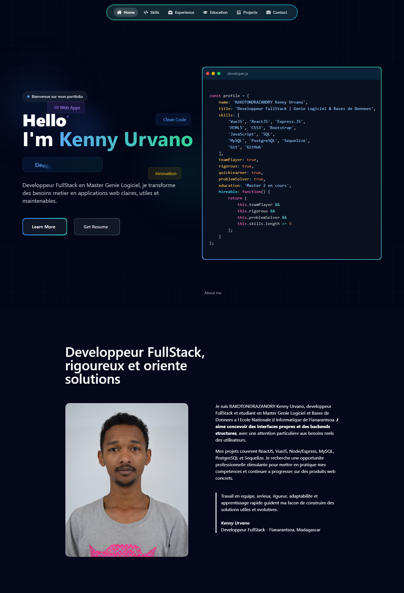

# Portfolio - Kenny Urvano

Portfolio personnel de **RAKOTONDRAZANDRY Kenny Urvano**, developpeur FullStack et etudiant en Master Genie Logiciel et Bases de Donnees a l'Ecole Nationale d'Informatique de Fianarantsoa.

Le site presente mon profil, mes competences, mon parcours, mes projets GitHub, ma formation et mes informations de contact.

## Demo



Demo locale avec Vite:

```text
http://localhost:5173
```

Demo production avec Docker/Nginx:

```text
http://localhost:8080
```

Repository GitHub:

[https://github.com/KennyU13/portfolio-main](https://github.com/KennyU13/portfolio-main)

## Sections

- Accueil et presentation
- A propos
- Competences techniques
- Experiences et projets
- Formation
- Projets GitHub
- Contact

## Stack Technique

- React 18
- Vite
- Tailwind CSS v3
- Framer Motion
- React Router
- Lucide React
- React Icons
- Docker
- Nginx pour le build production

## Competences Mises En Avant

- Front-end: ReactJS, VueJS, HTML5, CSS3, SCSS, Less, Bootstrap, Tailwind CSS
- Back-end: Node.js, Express.JS, NestJS, REST APIs
- Bases de donnees: MySQL, PostgreSQL, Sequelize, Prisma
- Langages: JavaScript, TypeScript, Java, PHP, C#, Dart, C, C++, Kotlin, SQL
- Outils: Git, GitHub, Docker, Vite, CMake, Flutter

## Projets

- [notes-app-fullstack](https://github.com/KennyU13/notes-app-fullstack)
- [BackMiniSocialNetwork](https://github.com/KennyU13/BackMiniSocialNetwork)
- [Code-ZahIT-ENI](https://github.com/KennyU13/Code-ZahIT-ENI)
- [Back_ExpressJS](https://github.com/KennyU13/Back_ExpressJS)
- [e-resto](https://github.com/KennyU13/e-resto)

## Installation Locale

```bash
npm install
npm run dev
```

Puis ouvrir:

```text
http://localhost:5173
```

## Build Production

```bash
npm run build
npm run preview
```

## Lancement Avec Docker

Mode developpement:

```bash
docker compose up portfolio-dev
```

Puis ouvrir:

```text
http://localhost:5173
```

Mode production:

```bash
docker compose up --build portfolio
```

Puis ouvrir:

```text
http://localhost:8080
```

## Contact

- GitHub: [KennyU13](https://github.com/KennyU13)
- Email: kennyurvano13@gmail.com
- Telephone: 034 89 804 67
- Localisation: Fianarantsoa, Madagascar

## Auteur

RAKOTONDRAZANDRY Kenny Urvano
